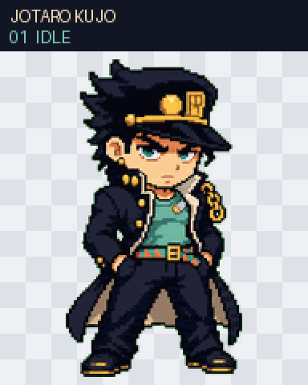
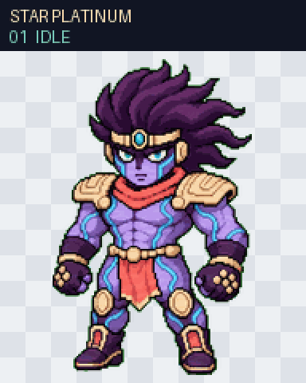
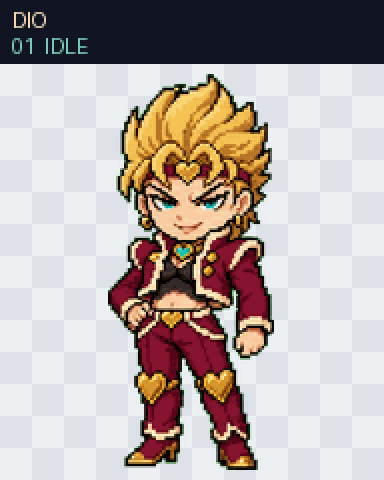
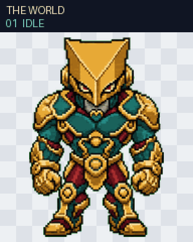

# Pilot V2 Animation Review

Status: engineering QA passed for all four Pilot pets; owner final animation review is pending.

Each 73-frame reel presents all nine standard Codex Pet V2 states in contract order, followed by the 16 clockwise look directions. The corresponding contact sheet shows the complete 8×11 atlas and every transparent unused cell.

Every final atlas is 1536×2288 with 192×208 cells and passed deterministic validation, chroma-edge QA, three independent blind direction reviews, continuity review, and independent final visual QA.

## Jotaro Kujo

[Full contact sheet](part-03-jotaro-kujo-v2-contact-sheet.png) · [16 look directions](part-03-jotaro-kujo-look-directions.png)

## Star Platinum

[Full contact sheet](part-03-star-platinum-v2-contact-sheet.png) · [16 look directions](part-03-star-platinum-look-directions.png)

## DIO

[Full contact sheet](part-03-dio-v2-contact-sheet.png) · [16 look directions](part-03-dio-look-directions.png)

## The World

[Full contact sheet](part-03-the-world-v2-contact-sheet.png) · [16 look directions](part-03-the-world-look-directions.png)

The owner approved the Pilot base designs and standard animation direction on 2026-07-19. Jotaro is released; the remaining three pets stay in `pilot-review` until this final animation review is approved.
