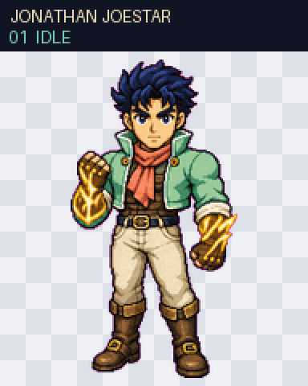
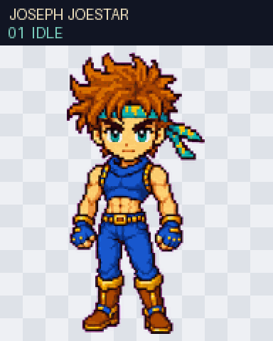
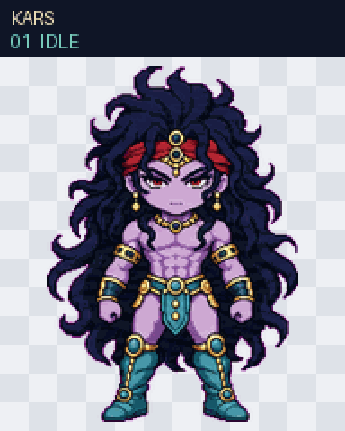

# Wave 1 Parts 1–2 Animation Review

Status: the owner approved all four base designs on 2026-07-19. All four pass the complete Codex Pet V2 engineering gate and were approved for public release on 2026-07-21.

Each reel below contains all nine standard animation states followed by the complete 16-direction look loop. Every package passed deterministic 1536×2288 V2 validation, three isolated blind direction reviews, continuity review, independent final visual QA, package validation, and local install verification.

## Jonathan Joestar

[Full V2 contact sheet](part-01-jonathan-joestar-v2-contact-sheet.png) · [16 look directions](part-01-jonathan-joestar-look-directions.png)

Gate result: pass. The shared chroma pipeline fix cleared the original edge findings. Final visual QA then found one detached white puff in `failed`; the complete eight-frame row was regenerated without loose effects and passed a second independent final review.

## Dio Brando

[Full V2 contact sheet](part-01-dio-brando-v2-contact-sheet.png) · [16 look directions](part-01-dio-brando-look-directions.png)

Gate result: pass. The 1536×2288 RGBA atlas passed deterministic V2 validation, all three independent blind direction reviews, continuity review, and independent final visual QA.

## Joseph Joestar

[Full V2 contact sheet](part-02-joseph-joestar-v2-contact-sheet.png) · [16 look directions](part-02-joseph-joestar-look-directions.png)

Gate result: pass. The corrected single-pass chroma pipeline cleared the original edge findings; all cardinal directions and final visual QA passed.

## Kars

[Full V2 contact sheet](part-02-kars-v2-contact-sheet.png) · [16 look directions](part-02-kars-look-directions.png)

Gate result: pass. The corrected single-pass chroma pipeline cleared the original edge findings. Intermediate look-angle uncertainty remains recorded as reviewed warnings, while all hard cardinal gates and the labeled continuous loop pass.

## Release result

The owner approved the final animation reels on 2026-07-21. All four catalog entries are `released`, their packages are publicly exported, and every supported per-pet install route is enabled.
