# Wave 2 Parts 4–6 Animation Review

Status: all 15 base designs and complete Codex Pet v2 animation packages passed engineering QA on 2026-07-21. Every package is installed locally for owner testing. Public release still requires final owner animation approval.

Each reel contains all nine standard animation states followed by the complete 16-direction look loop. Every package passed deterministic 1536 × 2288 v2 validation, three isolated blind direction reviews, continuity review, independent final visual QA, package validation, and local-install hash verification.

## Part 4

### Josuke Higashikata

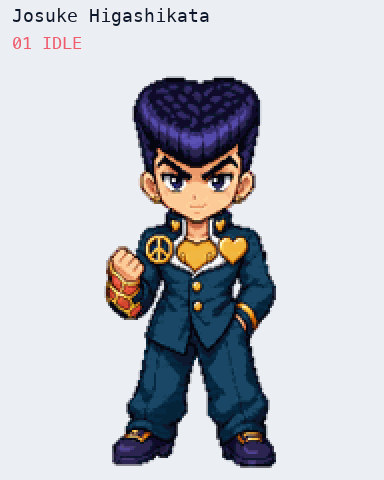

[Full V2 contact sheet](part-04-josuke-higashikata-v2-contact-sheet.png) · [16 look directions](part-04-josuke-higashikata-look-directions.png)

Gate result: pass. Secondary-axis cues at 067.5°, 112.5°, and 337.5° are subtle; cardinals, quadrants, and the ordered loop pass.

### Crazy Diamond

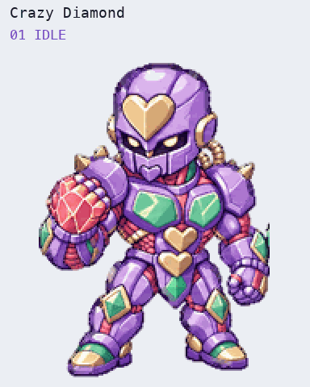

[Full V2 contact sheet](part-04-crazy-diamond-v2-contact-sheet.png) · [16 look directions](part-04-crazy-diamond-look-directions.png)

Gate result: pass. All 28 blind axis classifications pass. Remaining continuity findings are metric-only and do not produce a visible snap.

### Yoshikage Kira

[Full V2 contact sheet](part-04-yoshikage-kira-v2-contact-sheet.png) · [16 look directions](part-04-yoshikage-kira-look-directions.png)

Gate result: pass. The horizontal signs at 022.5° and 337.5° are intentionally subtle near 000°; vertical signs and hard cardinals pass.

### Killer Queen

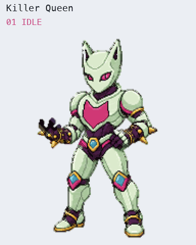

[Full V2 contact sheet](part-04-killer-queen-v2-contact-sheet.png) · [16 look directions](part-04-killer-queen-look-directions.png)

Gate result: pass. The isolated 202.5° horizontal sign is subtle and 157.5° is near-frontal, while the labeled down-facing sequence remains monotonic.

## Part 5

### Giorno Giovanna

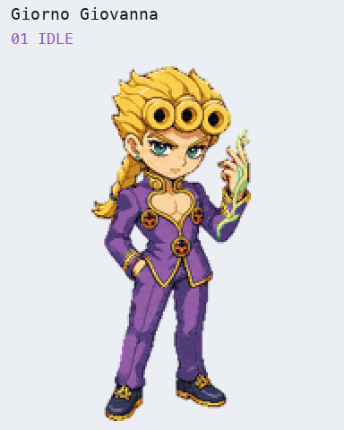

[Full V2 contact sheet](part-05-giorno-giovanna-v2-contact-sheet.png) · [16 look directions](part-05-giorno-giovanna-look-directions.png)

Gate result: pass. Near-cardinal secondary axes can be ambiguous when isolated; all hard gates and the complete labeled loop pass.

### Gold Experience

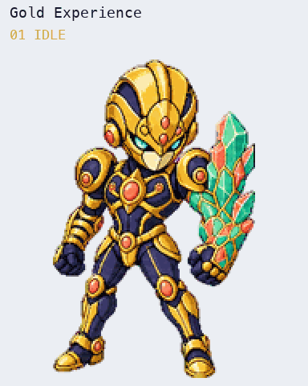

[Full V2 contact sheet](part-05-gold-experience-v2-contact-sheet.png) · [16 look directions](part-05-gold-experience-look-directions.png)

Gate result: pass. The isolated 225°/135° comparison remains review-only; the complete clockwise loop does not reverse.

### Gold Experience Requiem

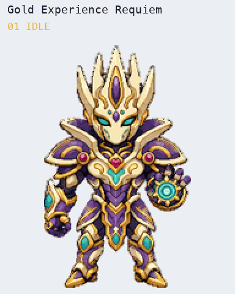

[Full V2 contact sheet](part-05-gold-experience-requiem-v2-contact-sheet.png) · [16 look directions](part-05-gold-experience-requiem-look-directions.png)

Gate result: pass. The 157.5° horizontal sign is subtle near 180°; its down-facing meaning and the full loop pass.

### Diavolo

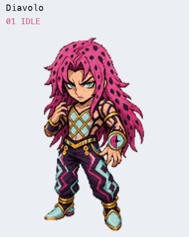

[Full V2 contact sheet](part-05-diavolo-v2-contact-sheet.png) · [16 look directions](part-05-diavolo-look-directions.png)

Gate result: pass. Remaining blind findings are intermediate-axis ambiguity only. Matched two-factor row registration keeps practical scale stable across the complete look loop.

### King Crimson

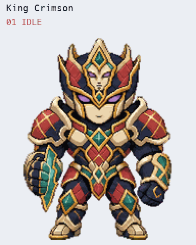

[Full V2 contact sheet](part-05-king-crimson-v2-contact-sheet.png) · [16 look directions](part-05-king-crimson-look-directions.png)

Gate result: pass. The 135°→180° and 270°→000° arcs are uneven but correctly ordered. The attached temporal slice remains part of the silhouette.

## Part 6

### Jolyne Cujoh

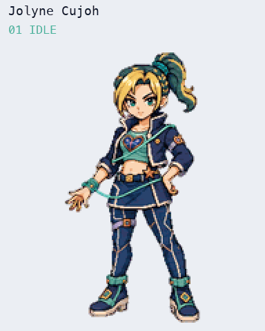

[Full V2 contact sheet](part-06-jolyne-cujoh-v2-contact-sheet.png) · [16 look directions](part-06-jolyne-cujoh-look-directions.png)

Gate result: pass. Review notes are limited to subtle near-cardinal horizontal signs; all hard direction gates pass.

### Stone Free

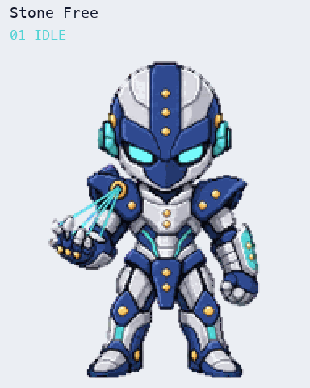

[Full V2 contact sheet](part-06-stone-free-v2-contact-sheet.png) · [16 look directions](part-06-stone-free-look-directions.png)

Gate result: pass. All 28 blind axis classifications pass. The lower-alpha edge treatment is intentional transparency rather than missing anatomy or chroma residue.

### Enrico Pucci

[Full V2 contact sheet](part-06-enrico-pucci-v2-contact-sheet.png) · [16 look directions](part-06-enrico-pucci-look-directions.png)

Gate result: pass. Measured silhouette outliers were independently classified as smooth pose changes, with no loop reversal or scale pop.

### Whitesnake

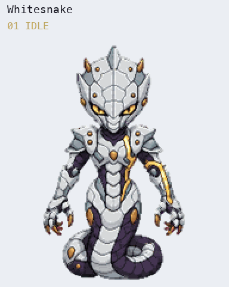

[Full V2 contact sheet](part-06-whitesnake-v2-contact-sheet.png) · [16 look directions](part-06-whitesnake-look-directions.png)

Gate result: pass. Blind warnings are intermediate-axis ambiguity only; the final labeled loop and attached gold cue pass.

### C-MOON

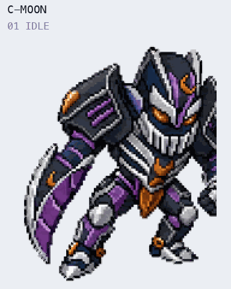

[Full V2 contact sheet](part-06-c-moon-v2-contact-sheet.png) · [16 look directions](part-06-c-moon-look-directions.png)

Gate result: pass. The isolated 067.5°/112.5° vertical-axis comparison produced a split reading, and 180°→202.5° is a larger pose transition. Cardinals, quadrants, baseline, practical scale, loop closure, and the attached crescent pressure cue all pass.

### Made in Heaven

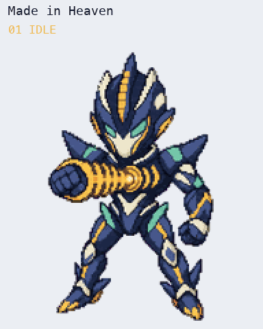

[Full V2 contact sheet](part-06-made-in-heaven-v2-contact-sheet.png) · [16 look directions](part-06-made-in-heaven-look-directions.png)

Gate result: pass. Intermediate-axis warnings remain recorded. The repaired running-right row keeps its amber acceleration band attached through every frame.

## Release gate

All 15 packages are engineering-approved and available in the repository, but their public install controls remain disabled while catalog status is `wave-review`. The owner can test the local installs now and approve or reject the complete Wave 2 animation batch before release.
