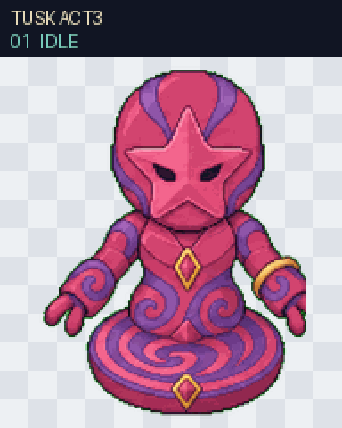

# Tusk ACT3 Release Review

Status: Tusk ACT3 passed the complete Codex Pet V2 quality gate on 2026-08-03 and is released as an independently installable pet.

The package contains all nine standard animation states and the complete 16-direction look loop. Deterministic validation confirms a transparent RGBA WebP atlas at 1536 × 2288 with the required 8 × 11 layout and no missing, opaque-background, or occupied-unused cells.

[Full V2 contact sheet](part-07-tusk-act-3-v2-contact-sheet.png) · [16 look directions](part-07-tusk-act-3-look-directions.png)

## Gate result

- Three isolated blind direction reviewers passed all four cardinal hard gates: 000 up, 090 right, 180 down, and 270 left.
- Independent final visual QA passed all nine standard rows with no identity drift, missing frame, crop, overlap, detached effect, direction error, gait reversal, or unintended size pop.
- Intermediate secondary-axis cues at 022.5°, 045°, 067.5°, 112.5°, 247.5°, 292.5°, 315°, and 337.5° remain recorded as accepted warnings. The labeled ordered loop stays in the correct quadrants and does not reverse.
- Continuity metric outliers at 022.5° → 045° and 315° → 337.5° remain recorded as accepted warnings; normal-size visual review found no snap, registration jump, or identity change.
- The packaged `spritesheet.webp` SHA-256 is `b54d175fdfa90878fab77f56b479b10e8040584e482e94835135671a218557e6`.

## Release result

The catalog entry is `released`, uses `/packages/part-07-tusk-act-3`, and exposes the existing English and Simplified Chinese detail-page URLs without adding a new indexed route.
